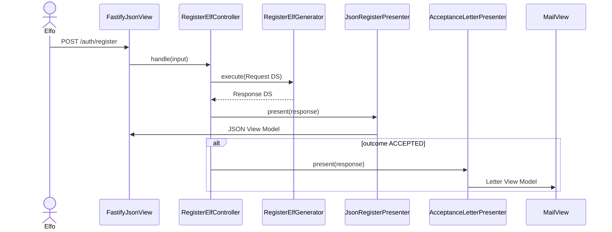
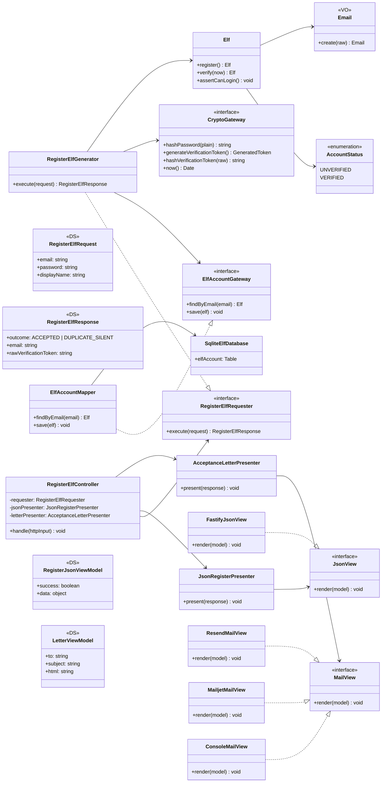
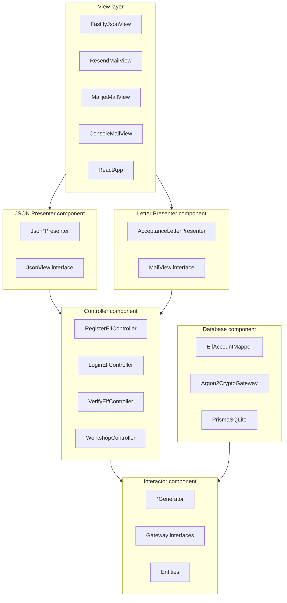

# Portal del Polo Norte (North Pole HR)

Intranet exclusiva para elfos: registro con verificación por correo, login JWT y tablero demo del taller de juguetes.

## Arquitectura

Clean Architecture (Fig. 8.2 / 8.3 de *Clean Architecture*):

- **Interactor**: reglas de negocio (`RegisterElfGenerator`, `VerifyElfGenerator`, `LoginElfGenerator`)
- **Controller**: orquesta Request/Response `<DS>` y presenters
- **Presenters**: JSON (web) y Carta de Aceptación (correo)
- **Views**: Fastify HTTP, Resend, Mailjet, consola (dev)
- **Database**: `ElfAccountMapper` + SQLite

Documentación detallada en [`docs/`](docs/). OCP parte 1 y 2: [`docs/ocp-parte-2.md`](docs/ocp-parte-2.md). OCP parte 3 (Mailjet): [`docs/ocp-parte-3-mailjet.md`](docs/ocp-parte-3-mailjet.md).

### Flujo de registro (secuencia)



### Diagrama de clases — Registro (Fig. 8.2)



Más diagramas (componentes, login, verify): [`docs/class-diagram.md`](docs/class-diagram.md) · [`docs/component-diagram.md`](docs/component-diagram.md)

### Componentes empaquetados (Fig. 8.2)



## Requisitos

- Node.js 20+
- pnpm 9+

## Inicio rápido

```bash
pnpm install
cp .env.example apps/api/.env
pnpm db:push
pnpm dev
```

- API: http://localhost:3001
- Web: http://localhost:5173

En desarrollo, `MAIL_DRIVER=console` imprime el link de verificación en la terminal del API.

## Variables de entorno (`apps/api/.env`)

| Variable | Descripción |
|----------|-------------|
| `PORT` | Puerto API (default 3001) |
| `DATABASE_URL` | SQLite, ej. `file:./dev.db` |
| `JWT_SECRET` | Secreto JWT (mín. 16 caracteres) |
| `APP_BASE_URL` | URL del frontend para links de correo |
| `EMAIL_FROM` | Remitente verificado en el proveedor (`resend` o `mailjet`) |
| `RESEND_API_KEY` | API key de Resend |
| `MAILJET_API_KEY` | Clave pública de Mailjet |
| `MAILJET_API_SECRET` | Clave privada de Mailjet |
| `MAIL_DRIVER` | `console`, `resend` o `mailjet` |

## Flujo de verificación

1. `POST /api/v1/auth/register` — cuenta `UNVERIFIED`, se envía la carta
2. El elfo abre el link `/verificar?token=...`
3. `POST /api/v1/auth/verify` — cuenta `VERIFIED`
4. `POST /api/v1/auth/login` — JWT solo si está verificada
5. `GET /api/v1/workshop/board` — tablero demo (Bearer JWT)

## Plantilla de correo

La plantilla HTML vive en:

`apps/api/src/presenters/acceptance-letter/acceptanceLetterTemplate.ts`

Sustituye `renderAcceptanceLetterHtml` cuando tengas tu diseño final.

## Tests

```bash
pnpm test:unit
pnpm test:integration
pnpm test
```

## Estructura

```
apps/api/src/
  entities/          # Elf, Email, invariantes
  interactors/       # Generators + Gateways I
  controllers/       # Controllers + Presenter I
  presenters/        # JSON + Carta
  views/             # HTTP + Mail
  database/          # Mapper + Crypto
  composition/       # Composition root
apps/web/src/        # React demo UI
docs/                # Diagramas y ADR
```

## Principios

- **SRP**: cada clase una responsabilidad (ver `docs/architecture.md`)
- **OCP**: nuevos canales de salida = nuevos Presenters/Views; Mailjet = `MailjetMailView`; nuevas reglas de formulario = nuevas `ValidationRule` sin tocar `FormPolicy` ni Generators
  (ver `docs/ocp-parte-2.md`, `docs/ocp-parte-3-mailjet.md`)
