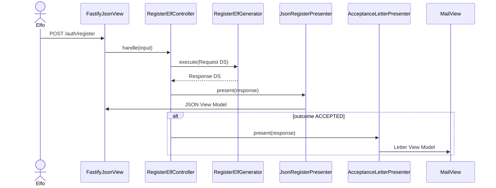
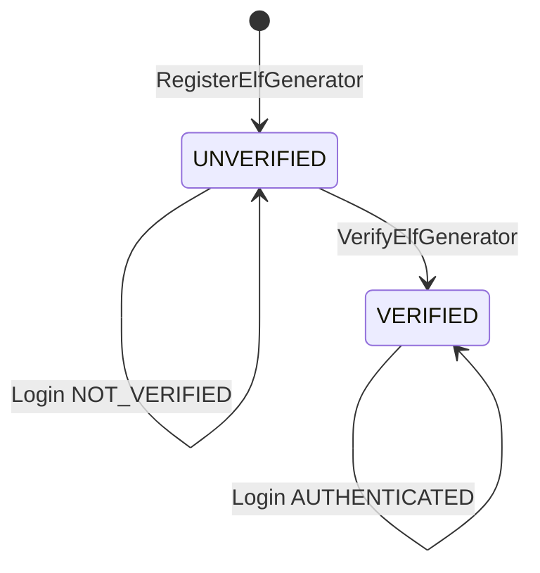

# Arquitectura — Portal del Polo Norte

## Visión general

El sistema implementa **Clean Architecture** siguiendo la partición de componentes de la Fig. 8.2 y las dependencias unidireccionales de la Fig. 8.3 (*Clean Architecture*, Robert C. Martin).

El núcleo estable es el **Interactor** (Generators + entidades). Todo lo demás depende hacia adentro.

## Capas y responsabilidades

| Componente | Responsabilidad (SRP) | Ejemplo |
|------------|----------------------|---------|
| **Entities** | Invariantes de dominio | `Elf.verify()` inmutable |
| **Interactor** | Orquestación de reglas sin I/O concreto | `RegisterElfGenerator` |
| **Gateway `<I>`** | Contrato de persistencia definido por el Interactor | `ElfAccountGateway` |
| **Controller** | Traduce HTTP → Request `<DS>`, invoca Requester, dispara Presenters | `RegisterElfController` |
| **Presenter `<I>`** | Contrato de salida definido por el Controller | `RegisterElfPresenter` |
| **Presenter concreto** | Formatea Response `<DS>` → View Model `<DS>` | `JsonRegisterPresenter`, `AcceptanceLetterPresenter` |
| **View `<I>`** | Canal de entrega | `JsonView`, `MailView` |
| **View concreta** | Implementación tecnológica | `FastifyJsonView`, `ResendMailView`, `MailjetMailView` |
| **Mapper** | Traduce filas DB ↔ entidades | `ElfAccountMapper` |

## Regla de dependencia

```
Views → Presenters → Controllers → Interactors ← Database (Mapper)
```

El Interactor **nunca** importa Fastify, Prisma, Resend ni `jose`.

## Open/Closed en la práctica

### Canal Screen (JSON)

`JsonRegisterPresenter` + `FastifyJsonView` devuelven el envelope HTTP al cliente React.

### Canal Print (Carta)

`AcceptanceLetterPresenter` + `MailView` envían la Carta de Aceptación. Los adapters actuales son `ResendMailView`, `MailjetMailView` y `ConsoleMailView`.

Añadir un proveedor (Mailjet, SendGrid, consola) = **nueva View**, sin modificar `RegisterElfGenerator`. Detalle: [`ocp-parte-3-mailjet.md`](ocp-parte-3-mailjet.md).

### Persistencia (parte 4)

`ElfAccountGateway` + `ElfAccountMapper` (Prisma/SQLite) y `PgliteElfAccountMapper` (PostgreSQL embebido). Añadir un motor = **nuevo mapper**, sin modificar los Generators. Detalle: [`ocp-parte-4-db-engine.md`](ocp-parte-4-db-engine.md).

### JWT fuera del Interactor

`LoginElfGenerator` solo decide `AUTHENTICATED | NOT_VERIFIED | INVALID`.

`JsonLoginPresenter` + `JoseSessionTokenIssuer` emiten el JWT en el View Model. Cambiar a cookies httpOnly = nuevo Presenter.

### Validación de registro (parte 2)

`FormPolicy` + `MinLengthRule` (`implements ValidationRule`). Cambiar umbrales o añadir una regla = composición, sin abrir el Generator ni el formulario. Detalle en [`ocp-parte-2.md`](ocp-parte-2.md).

## Flujo de registro



## Estados de cuenta



## Seguridad

- Contraseñas: Argon2id (`Argon2CryptoGateway`)
- Token de correo: 32 bytes, SHA-256 en DB, TTL 24h, un solo uso
- JWT: HS256, expiración 1h, solo en Presenter de login
- Anti-enumeración: registro duplicado responde igual, sin carta

## Tests

| Capa | Ubicación | Estrategia |
|------|-----------|------------|
| Entities | `tests/unit/entities/` | Sin I/O |
| Generators | `tests/unit/generators/` | Gateways fake |
| Presenters | `tests/unit/presenters/` | Views fake |
| Mail views | `tests/unit/views/` | `send` fake / `fetch` stub |
| Integración | `tests/integration/` | Prisma + PGlite + ConsoleMailView |

## Plantilla de correo

Archivo: `apps/api/src/presenters/acceptance-letter/acceptanceLetterTemplate.ts`

Contiene un HTML placeholder listo para reemplazar con tu diseño final.
