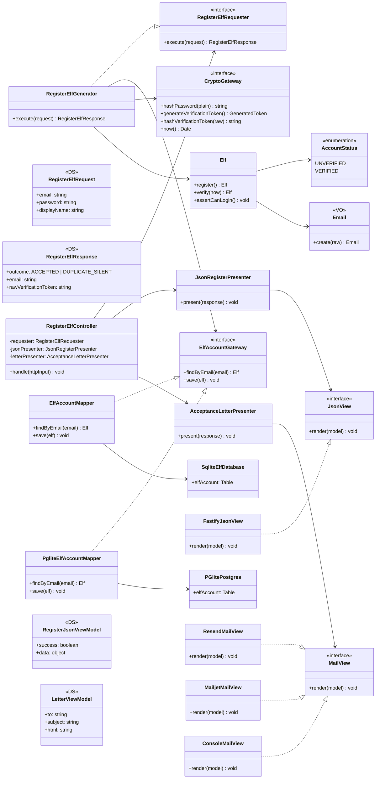

# Diagrama de clases — Registro de elfo (Fig. 8.2)

Este diagrama replica la partición del libro: **Controller | Interactor | Database | Screen Presenter | Letter Presenter | Views**.

## Diagrama principal

## Login y Verify (misma plantilla)

### Login

| Clase | Rol |
|-------|-----|
| `LoginElfController` | HTTP → Request DS |
| `LoginElfGenerator` | Requester: credenciales + estado VERIFIED |
| `JsonLoginPresenter` | Response → JWT en View Model |
| `JoseSessionTokenIssuer` | Infra: firma JWT (no en Interactor) |

### Verify

| Clase | Rol |
|-------|-----|
| `VerifyElfController` | HTTP → `{ rawToken }` |
| `VerifyElfGenerator` | Valida hash, expiración, marca VERIFIED |
| `JsonVerifyPresenter` | Response → mensaje de bienvenida |

### Workshop

| Clase | Rol |
|-------|-----|
| `WorkshopController` | Extrae Bearer, verifica JWT |
| `WorkshopBoardGenerator` | Datos mock del taller |
| `JsonWorkshopPresenter` | Tablero → JSON |

## SRP por clase

| Clase | Una razón de cambiar |
|-------|---------------------|
| `Elf` | Invariantes de cuenta |
| `RegisterElfGenerator` | Proceso de alta |
| `AcceptanceLetterPresenter` | Copy/HTML de la carta |
| `acceptanceLetterTemplate.ts` | Diseño visual del correo |
| `ResendMailView` | SDK Resend |
| `MailjetMailView` | Send API v3.1 (Mailjet) |
| `JsonRegisterPresenter` | Formato JSON / códigos HTTP |
| `ElfAccountMapper` | Esquema SQL Prisma/SQLite |
| `PgliteElfAccountMapper` | Esquema SQL PGlite (PostgreSQL embebido) |
| `RegisterElfController` | Cableado request + presenters |

## OCP

### Parte 1 — canales de salida

- Nuevo canal de correo → `implements MailView` (`ConsoleMailView`, `ResendMailView`, `MailjetMailView`)
- Nuevo formato de API → `implements RegisterElfPresenter` o nuevo Presenter JSON
- Nuevo almacén → `implements ElfAccountGateway` (`ElfAccountMapper`, `PgliteElfAccountMapper`)

Los Generators permanecen cerrados a modificación.

Documentación: [`docs/ocp-parte-3-mailjet.md`](ocp-parte-3-mailjet.md).

### Parte 2 — reglas de registro

- Nueva política de campo → `implements ValidationRule` (hoy `MinLengthRule`)
- Cambiar umbral de nombre o contraseña → composición en `registerFormPolicy` (API y web)

`FormPolicy`, `RegisterPage` y `RegisterElfGenerator` permanecen cerrados a modificación.

Documentación: [`docs/ocp-parte-2.md`](ocp-parte-2.md).

### Parte 3 — proveedor Mailjet

- Nuevo proveedor de correo → `MailjetMailView implements MailView`
- `createMailView` es el único `switch` de creación

`RegisterElfGenerator` y `AcceptanceLetterPresenter` permanecen cerrados a modificación.

Documentación: [`docs/ocp-parte-3-mailjet.md`](ocp-parte-3-mailjet.md).

### Parte 4 — motor de persistencia

- Nuevo motor → `PgliteElfAccountMapper implements ElfAccountGateway`
- `createElfAccountGateway` es el único `switch` de creación

Los Generators permanecen cerrados a modificación.

Documentación: [`docs/ocp-parte-4-db-engine.md`](ocp-parte-4-db-engine.md).
