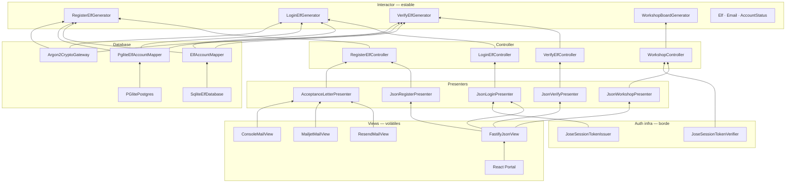
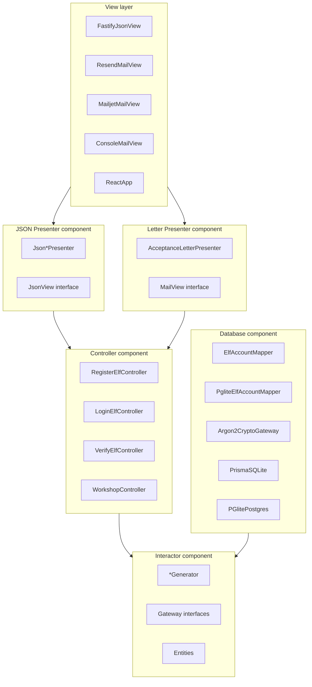

# Diagrama de componentes — Dependencias unidireccionales (Fig. 8.3)

Todas las flechas apuntan **hacia** el Interactor (componente más estable).

## Diagrama de componentes

## Tabla de dependencias

| Origen | Destino | Interfaz / contrato |
|--------|---------|---------------------|
| Controller | Interactor | `*Requester` |
| Mapper | Interactor | `ElfAccountGateway` |
| CryptoGateway | Interactor | `CryptoGateway` |
| Presenter | Controller | `*Presenter` (en paquete controller) |
| View | Presenter | `JsonView` / `MailView` |
| TokenIssuer | Login Presenter | `SessionTokenIssuer` |
| TokenVerifier | Workshop Controller | `SessionTokenVerifier` |

## Componentes empaquetados (Fig. 8.2)

## Por qué el Interactor no llama al Presenter

Si el Generator invocara directamente al envío de correo, el Interactor dependería de un detalle de salida y se rompería la Fig. 8.3.

El **Controller** es quien:

1. Llama al Requester (Generator).
2. Recibe el Response `<DS>`.
3. Itera los Presenters registrados (JSON + Carta).

Eso permite OCP: registrar un tercer Presenter (SMS, PDF) sin tocar el Generator.

## Correspondencia con el código

| Componente diagrama | Carpeta |
|--------------------|---------|
| Interactor | `apps/api/src/interactors/` + `entities/` |
| Controller | `apps/api/src/controllers/` |
| Presenters | `apps/api/src/presenters/` |
| Views | `apps/api/src/views/` |
| Database | `apps/api/src/database/` |
| Composition root | `apps/api/src/composition/` |
