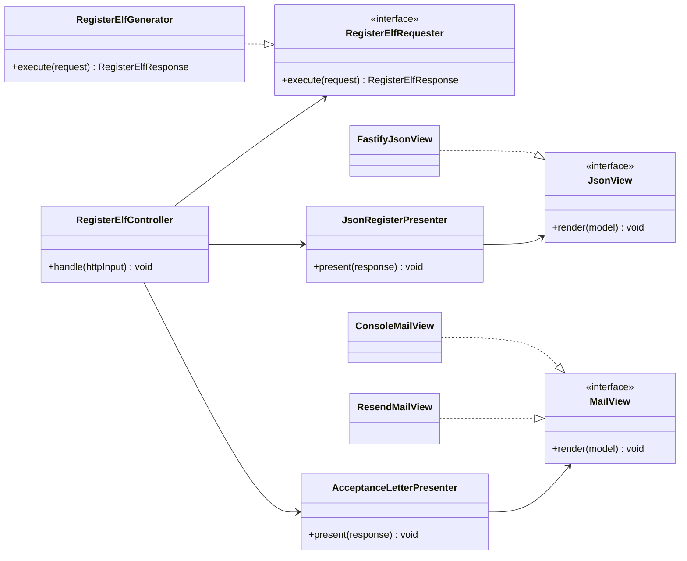
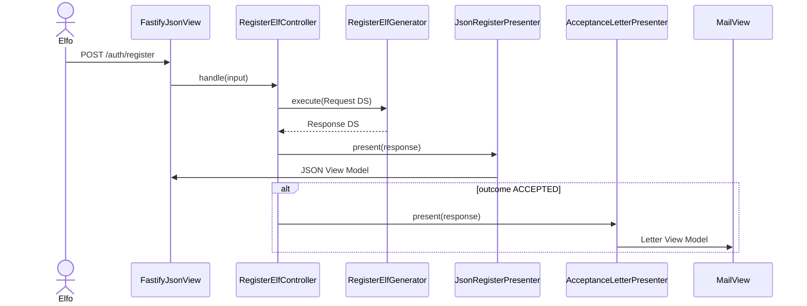
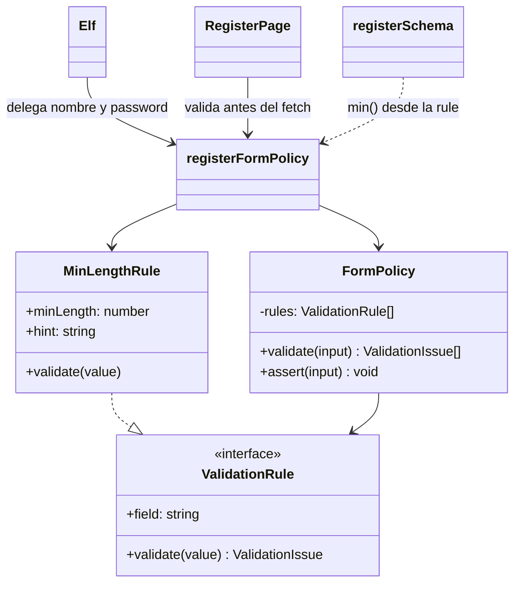
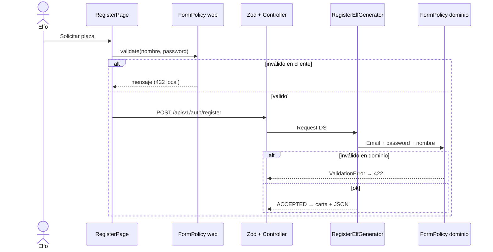

# OCP parte 2 — Validación del formulario de registro

**Rama:** `feat/ocp-parte-2-validacion`  
**Base:** `main` (`docs: finalizar fase 1`)  
**PR a `main`:** pendiente (este documento es el cuerpo del PR)

Este documento cubre dos cosas que pide la práctica:

1. Cómo **debía funcionar el OCP de la parte 1** (canales de salida: JSON + carta).
2. Qué se hizo en la **parte 2**: actualizar dos reglas de validación en frontend y backend **sin reescribir** el formulario ni el Generator.

---

## 1. OCP de la parte 1 — canales de salida

### Principio

*Open/Closed* (Bertrand Meyer / SOLID): el software debe estar **abierto a extensión** y **cerrado a modificación**.

En la parte 1 el núcleo estable es el **Interactor**. `RegisterElfGenerator` orquesta el alta del elfo y **no sabe** si el resultado se pinta en JSON, se envía por Resend o se imprime en consola. Eso es exactamente la Fig. 8.2 / 8.3 de *Clean Architecture*.

### Diagrama de clases (parte 1)



### Por qué el Generator no envía el correo

Si `RegisterElfGenerator` llamara a Resend, el Interactor dependería de un detalle volátil. Cada canal nuevo (SMS, PDF, Slack) **abriría** el Generator.

El **Controller** recibe el Response `<DS>` y recorre los Presenters. Añadir un canal = nueva clase `implements MailView` (o un Presenter extra) en el composition root.

| Extensión | Qué se crea | Qué NO se toca |
|-----------|-------------|----------------|
| Correo en consola (dev) | `ConsoleMailView` | Generator, entidades |
| Mailjet en vez de (o junto a) Resend | `MailjetMailView implements MailView` | Generator, Presenter de carta |
| SendGrid en vez de Resend | `SendGridMailView implements MailView` | Generator, Presenter de carta |
| Cookies httpOnly en vez de JWT | nuevo Presenter de login | `LoginElfGenerator` |

La extensión Mailjet está implementada en [`ocp-parte-3-mailjet.md`](ocp-parte-3-mailjet.md).

Diagramas 1:1 con el código: [`class-diagram.md`](class-diagram.md), [`component-diagram.md`](component-diagram.md), [`adr/0001-clean-architecture-boundaries.md`](adr/0001-clean-architecture-boundaries.md).

### Secuencia de registro (parte 1)



Eso **ya estaba implementado** en la fase 1. La parte 2 no lo deshace.

---

## 2. El hueco: la validación no era OCP

Antes de esta rama, las dos reglas del formulario estaban **hardcodeadas en cuatro sitios**:

| Regla | Entidad | HTTP (Zod) | UI | Tests e2e |
|-------|---------|------------|----|-----------|
| Contraseña ≥ 8 | `Elf.validatePassword` | `z.string().min(8)` | `minLength={8}` + hint | `min(8)` |
| Nombre ≥ 2 | `Elf.register` | `z.string().min(2)` | `minLength={2}` | `min(2)` |

Cambiar un umbral exigía **modificar** clases existentes. Eso viola OCP: el sistema no estaba cerrado a modificación para políticas de formulario.

---

## 3. Parte 2 — Strategy de validación + dos reglas nuevas

### Qué se actualizó (la consigna)

| Campo | Antes | Después | Archivo que **sí** cambia el umbral |
|-------|-------|---------|-------------------------------------|
| Contraseña | mínimo 8 | mínimo **12** | `registerFormPolicy` (API y web) |
| Nombre del elfo | mínimo 2 | mínimo **3** | `registerFormPolicy` (API y web) |

El login **no** exige 12 caracteres: la política de registro no se reutiliza al autenticar. Cuentas antiguas o el flujo login/verify siguen comprobando el hash, no la fuerza de alta.

### Diagrama de clases (parte 2)

Misma idea que `MailView`: una interfaz, implementaciones concretas, composición.



**Cerrado a modificación:** `FormPolicy`, `RegisterPage`, `RegisterElfGenerator`, `RegisterElfController`.  
**Abierto a extensión:** nuevas clases `implements ValidationRule` o nuevos `MinLengthRule(campo, N)` en la lista de `registerFormPolicy`.

### Cómo se extiende una tercera regla (sin tocar el validador)

```ts
// Solo composición — FormPolicy no se edita
export const registerFormPolicy = new FormPolicy([
  registerDisplayNameRule,
  registerPasswordRule,
  new RequiresDigitRule("password"), // ejemplo futuro
]);
```

Eso es el análogo de `new SendGridMailView()` en la parte 1.

### Secuencia con las dos capas de validación



Frontend y backend **duplican el mismo patrón a propósito** (la consigna pide tocar ambos). Los umbrales tienen que coincidir; Zod lee `minLength` de las rules del API para no volver a hardcodear `12` y `3` en `main.ts`.

### Correspondencia código

| Concepto | API | Web |
|----------|-----|-----|
| Contrato | `entities/validation/ValidationRule.ts` | `src/validation/ValidationRule.ts` |
| Estrategia | `MinLengthRule.ts` | `MinLengthRule.ts` |
| Cerrado a modificación | `FormPolicy.ts` | `FormPolicy.ts` |
| Composición (aquí se cambian umbrales) | `registerFormPolicy.ts` | `registerFormPolicy.ts` |
| Uso | `Elf.register` / `Elf.validatePassword` / Zod | `RegisterPage` |

---

## 4. Evidencia de tests (TDD)

Jornadas:

- Como elfo, quiero que un nombre de 2 letras no pase el registro.
- Como elfo, quiero que una contraseña de 11 caracteres no pase el registro.
- Como elfo, quiero ver el hint “Mínimo 12 caracteres” / “Mínimo 3 caracteres” en el formulario.
- Como elfo ya verificado, quiero entrar al taller aunque la política de **alta** haya subido a 12 (el login no reusa esa policy).

| # | Garantía | Test | Tipo | Resultado |
|---|----------|------|------|-----------|
| 1 | `FormPolicy` aplica reglas compuestas, no hardcodeadas | `apps/api/tests/unit/entities/FormPolicy.test.ts` | unit | PASS |
| 2 | Nombre &lt; 3 y password &lt; 12 fallan en `Elf` | `apps/api/tests/unit/entities/Elf.test.ts` | unit | PASS |
| 3 | Generator rechaza payload bajo la policy | `RegisterElfGenerator.test.ts` | unit | PASS |
| 4 | HTTP 422 si nombre o password no cumplen | `tests/e2e/auth.http.e2e.test.ts` | e2e | PASS |
| 5 | Mismas reglas en el cliente | `apps/web/src/validation/registerFormPolicy.test.ts` | unit | PASS |
| 6 | Flujo register → verify → login sigue vivo | `tests/integration/auth.flow.test.ts` | integration | PASS |

Comandos:

```bash
pnpm test:unit
pnpm test:web
pnpm test:integration
pnpm test:e2e
```

---

## 5. Texto listo para el PR a `main`

Cuando se abra el PR (`feat/ocp-parte-2-validacion` → `main`), se puede pegar esto:

```markdown
## Summary
- Aplica OCP a la validación de registro: `ValidationRule` + `FormPolicy` + `MinLengthRule` (API y web).
- Actualiza dos reglas del formulario: nombre mínimo 2→3, contraseña mínimo 8→12, en frontend y backend.
- Documenta cómo funcionaba el OCP de la parte 1 (Presenters/Views) y cómo se extiende ahora una regla sin abrir `FormPolicy` ni el Generator.
- El login no hereda el umbral de 12 caracteres.

## Test plan
- [ ] `pnpm test:unit` y `pnpm test:web`
- [ ] `pnpm test:integration` y `pnpm test:e2e`
- [ ] UI `/registro`: nombre "Al" muestra error; password de 11 caracteres muestra error
- [ ] UI `/registro`: nombre ≥ 3 y password ≥ 12 envían la solicitud
- [ ] Login de una cuenta verificada sigue funcionando
```

Detalle: [`docs/ocp-parte-2.md`](ocp-parte-2.md).
