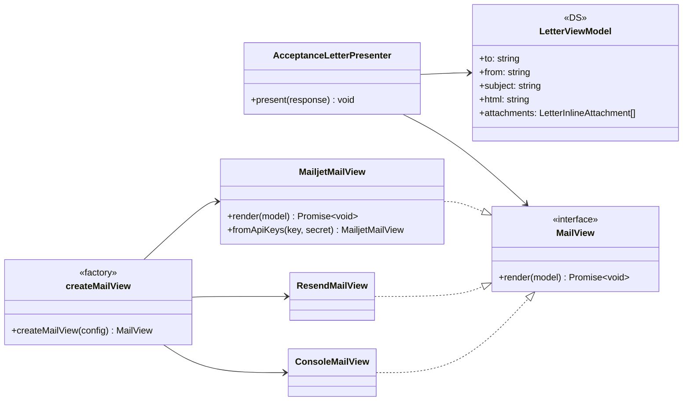
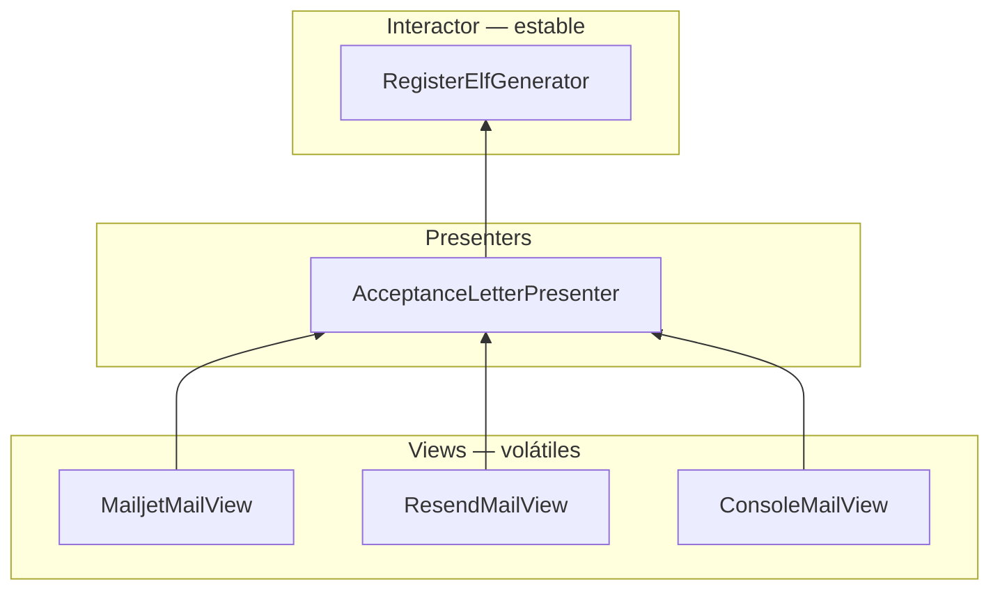
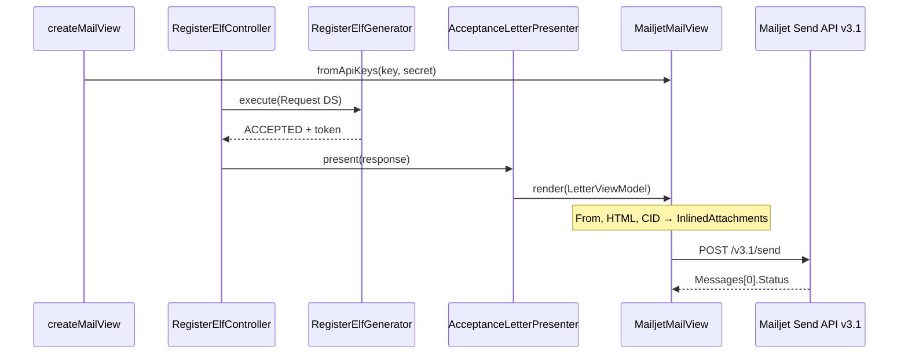

# OCP parte 3 — Mailjet como tercer `MailView`

**Rama:** `feat/ocp-mailjet-mail-view`  
**Base:** `main`  
**PR a `main`:** este documento es el cuerpo del PR

Este cambio **no reabre** el Interactor ni el Presenter de la carta. Añade un adapter concreto (`MailjetMailView`) detrás del puerto que ya existía (`MailView`). Es la misma extensión que *Clean Architecture* cap. 8 describe con el reporte web vs. impreso: el análisis permanece cerrado; cambia el canal de salida.

## Principio

*Open/Closed* (Bertrand Meyer, *Object-Oriented Software Construction*, 1988, p. 23; Robert C. Martin, *Clean Architecture*, 2017, cap. 8): las entidades software deben estar **abiertas a extensión** y **cerradas a modificación**.

OCP **no** significa “nunca editar un archivo”. El composition root (`createMailView`) es el sitio permitido para el `switch` de **creación**. El Generator no tiene un `if (provider === "mailjet")`.

## Qué se crea / qué no se toca

| Extensión | Qué se crea | Qué NO se toca |
|-----------|-------------|----------------|
| Mailjet | `MailjetMailView implements MailView` | `RegisterElfGenerator`, entidades |
| Factory de correo | `createMailView` + `parseMailDriver` | `AcceptanceLetterPresenter`, `MailView` |
| Parseo de remitente | `parseEmailFrom` (infra Mailjet) | Plantilla HTML, CIDs |
| Drivers previos | — | `ConsoleMailView`, `ResendMailView` (mismo contrato) |

## Diagrama de clases (canal de correo)



## Dependencias (Fig. 8.3)

Las flechas de **código fuente** apuntan hacia el puerto. Mailjet es un detalle volátil en Views.



## Secuencia al registrar con `MAIL_DRIVER=mailjet`



## Por qué no se usó el paquete `node-mailjet`

El adapter habla el contrato HTTP público (Send API v3.1 + Basic auth). Eso es el mismo protocolo que el SDK envuelve. Evita acoplar el módulo a un cliente CJS y a una dependencia extra; `MailjetMailView.render` se testea con un `send` inyectado (DIP en el borde, no wrapping de `fetch` en el dominio).

## Configuración

| Variable | Uso |
|----------|-----|
| `MAIL_DRIVER=mailjet` | Elige el adapter |
| `MAILJET_API_KEY` | Clave pública |
| `MAILJET_API_SECRET` | Clave privada |
| `EMAIL_FROM` | Remitente **verificado** en Mailjet (`Name <email>` o email suelto) |

`console` y `resend` siguen siendo drivers válidos. Un `MAIL_DRIVER` desconocido **falla al arranque** (ya no cae a consola en silencio).

## Auditoría SOLID — canal de correo

### Resumen

El puerto `MailView` ya tenía dos implementaciones reales. Mailjet es la tercera: OCP se demuestra **usando** el puerto, no extrayendo otro. El único sitio reabierto es el composition root.

### Hallazgos cerrados en este PR

#### [P2] OCP — `if` de creación duplicado en `CompositionRoot`

**Síntoma:** el ternario `resend` vs `console` vivía en `buildControllers` y `buildRegisterController`.

**Refactor:** `createMailView(config)` único. El `switch` de creación queda en un solo módulo de infra.

**Costo:** un archivo de factory. Justificado: tres concretos reales.

### Lo que está bien

- `RegisterElfGenerator` no importa Mailjet ni `process.env`.
- `AcceptanceLetterPresenter` sigue dependiendo solo de `MailView`.
- LSP: Mailjet traduce CID → `InlinedAttachments` **dentro** del adapter; el Presenter no ve el JSON de Mailjet.
- ISP: el puerto sigue siendo un método (`render`). No se hinchó con APIs de campaña.

### Explícitamente NO recomendado (y no se hizo)

- `IMailViewImpl`, registro de plugins, `NotificationChannel` (email+SMS+push).
- Borrar Resend “para usar solo Mailjet”.
- Mover el envío al Generator.
- Envolver `Buffer`/`Date`/`JSON`.

### Checklist de review

- [x] Actores: equipo de notificaciones / infra de correo.
- [x] Variante nueva no reabre el interactor.
- [x] Sin `instanceof` en dominio.
- [x] Adapter cumple el mismo contrato (HTML + inline CID o `Error`).
- [x] Concretos volátiles nombrados en el root/factory.
- [x] Cada interface nueva tiene implementación real (ninguna interface nueva).

## Tests

Evidencia TDD: [`docs/testing/ocp-mailjet.tdd.md`](testing/ocp-mailjet.tdd.md).

```bash
pnpm --filter @north-pole/api test:unit
pnpm --filter @north-pole/api test:integration
pnpm --filter @north-pole/api test:e2e
```

Los tests de `RegisterElfGenerator` no cambian: prueba de que el núcleo permaneció cerrado.
