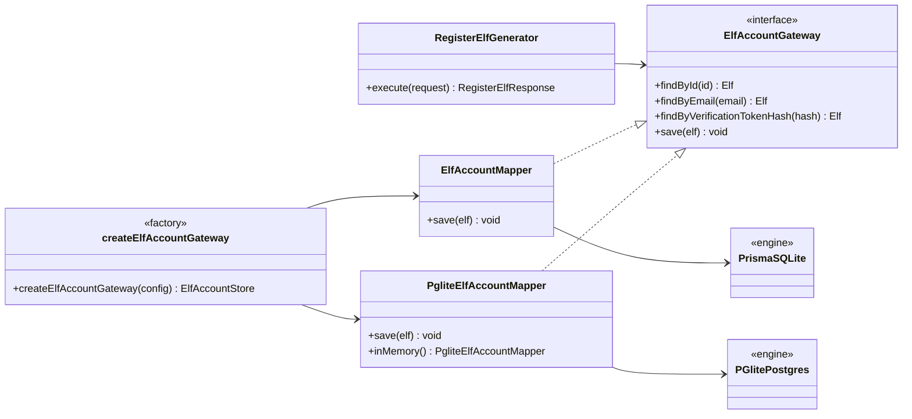
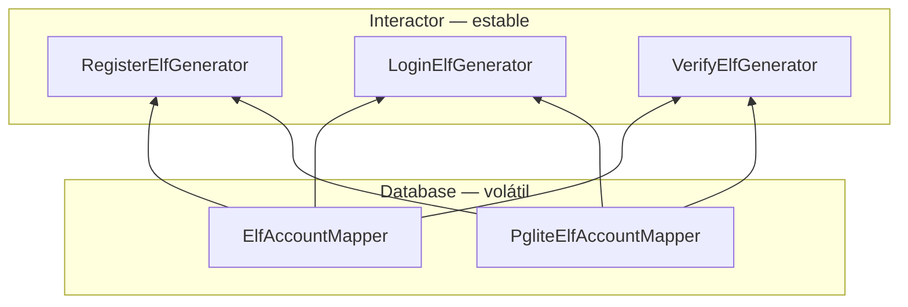
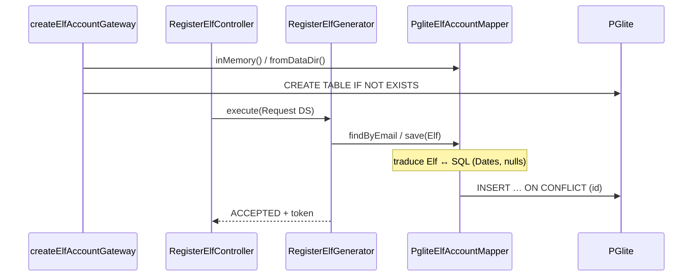

# OCP parte 4 — PGlite como segundo motor (`ElfAccountGateway`)

**Rama:** `feat/ocp-db-engine-pglite`  
**Base:** `main`  
**PR a `main`:** este documento es el cuerpo del PR

Este cambio **no reabre** los Interactors. Añade un adapter concreto (`PgliteElfAccountMapper`) detrás del puerto que ya existía (`ElfAccountGateway`). Es la misma extensión que Mailjet en el canal de correo y que *Clean Architecture* cap. 8 describe con el reporte web vs. impreso: el análisis permanece cerrado; cambia el detalle de persistencia.

Cambiar `provider = "sqlite"` a `"postgresql"` **dentro de Prisma no demuestra OCP de la aplicación**: el mapper ni los generators se enteran. La prueba es una **clase nueva**.

## Principio

*Open/Closed* (Bertrand Meyer, *Object-Oriented Software Construction*, 1988, p. 23; Robert C. Martin, *Clean Architecture*, 2017, cap. 8): las entidades software deben estar **abiertas a extensión** y **cerradas a modificación**.

OCP **no** significa “nunca editar un archivo”. El composition root (`createElfAccountGateway`) es el sitio permitido para el `switch` de **creación**. El Generator no tiene un `if (DB_DRIVER === "pglite")`.

## Qué se crea / qué no se toca

| Extensión | Qué se crea | Qué NO se toca |
|-----------|-------------|----------------|
| PostgreSQL embebido | `PgliteElfAccountMapper implements ElfAccountGateway` | `RegisterElfGenerator`, `LoginElfGenerator`, `VerifyElfGenerator`, entidades |
| Factory de persistencia | `createElfAccountGateway` + `parseDbDriver` | El puerto `ElfAccountGateway` |
| Schema de una tabla | `pgliteElfAccountSchema.sql.ts` | `schema.prisma` (Prisma/SQLite se conserva) |
| Driver previo | — | `ElfAccountMapper` (mismo contrato; solo se corrigió el import type) |

## Diagrama de clases (persistencia)



## Dependencias (Fig. 8.3)

Las flechas de **código fuente** apuntan hacia el Interactor. Prisma y PGlite son detalles volátiles en Database.



## Secuencia al registrar con `DB_DRIVER=pglite`



LSP: PGlite traduce timestamps a `Date` **dentro** del adapter. El Generator no ve filas SQL ni WASM.

## Correspondencia código

| Concepto | Archivo |
|----------|---------|
| Puerto (cerrado) | `interactors/shared/ElfAccountGateway.ts` |
| Interactors (cerrados) | `RegisterElfGenerator`, `LoginElfGenerator`, `VerifyElfGenerator` |
| Adapter Prisma/SQLite | `database/ElfAccountMapper.ts` |
| Adapter nuevo | `database/PgliteElfAccountMapper.ts` |
| Factory (único switch) | `database/createElfAccountGateway.ts` |
| Wiring | `composition/CompositionRoot.ts` recibe `ElfAccountGateway` |

## Configuración

| Variable | Uso |
|----------|-----|
| `DB_DRIVER=prisma` | Adapter Prisma + SQLite (default) |
| `DB_DRIVER=pglite` | Adapter PostgreSQL embebido |
| `DATABASE_URL` | Solo Prisma (`file:./dev.db`) |
| `PGLITE_DATA_DIR` | Opcional; si falta, PGlite en memoria |

`prisma` sigue siendo el default. Un `DB_DRIVER` desconocido **falla al arranque** (no cae a Prisma en silencio).

## Auditoría SOLID — persistencia

### Resumen

El puerto `ElfAccountGateway` ya tenía Prisma y un fake in-memory en tests. PGlite es el segundo motor de producción: OCP se demuestra **usando** el puerto, no extrayendo otro. El único sitio reabierto es el composition root.

### Hallazgos cerrados en este PR

#### [P2] OCP + DIP — `PrismaClient` en las firmas del root

**Síntoma:** `buildRegisterController(db: PrismaClient)` nombraba el concreto volátil.

**Refactor:** `createElfAccountGateway(config)` único. Los `build*` reciben `ElfAccountGateway`.

**Costo:** un archivo de factory. Justificado: dos concretos reales de producción.

#### [P2] LSP en tests de integración

**Síntoma:** el flujo mutaba filas con `db.elfAccount.update`.

**Refactor:** register → login 403 → verify → login 200 habla el puerto. El mismo helper corre contra Prisma y PGlite.

### Lo que está bien

- Los Generators no importan `@prisma/client` ni `@electric-sql/pglite`.
- ISP: el puerto sigue siendo los cuatro métodos que el Interactor pidió.
- LSP: Dates y `null` se normalizan en el adapter.

### Explícitamente NO recomendado (y no se hizo)

- Cambiar solo `schema.prisma` `provider` y llamarlo OCP.
- Borrar Prisma/SQLite “para usar solo PGlite”.
- `GenericRepository<T>`, `UnitOfWork`, `IPgliteClient` 1:1 con el SDK.
- `if (DB_DRIVER)` en el Generator.
- Envolver `Date` / `JSON`.

### Checklist de review

- [x] Actores: equipo de infra / persistencia.
- [x] Variante nueva no reabre el interactor.
- [x] Sin `instanceof` en dominio.
- [x] Adapter cumple el mismo contrato (`Elf | null`, `Date`, save por id).
- [x] Concretos volátiles nombrados en el root/factory.
- [x] Cada interface nueva tiene implementación real (ninguna interface de dominio nueva; `PgliteSqlClient` es el borde de infra, 3 métodos).

## Tests

Evidencia TDD: [`docs/testing/ocp-db-engine.tdd.md`](testing/ocp-db-engine.tdd.md).

```bash
pnpm --filter @north-pole/api test:unit
pnpm --filter @north-pole/api test:integration
pnpm --filter @north-pole/api test:e2e
```

Los tests de `RegisterElfGenerator` no cambian: prueba de que el núcleo permaneció cerrado.
